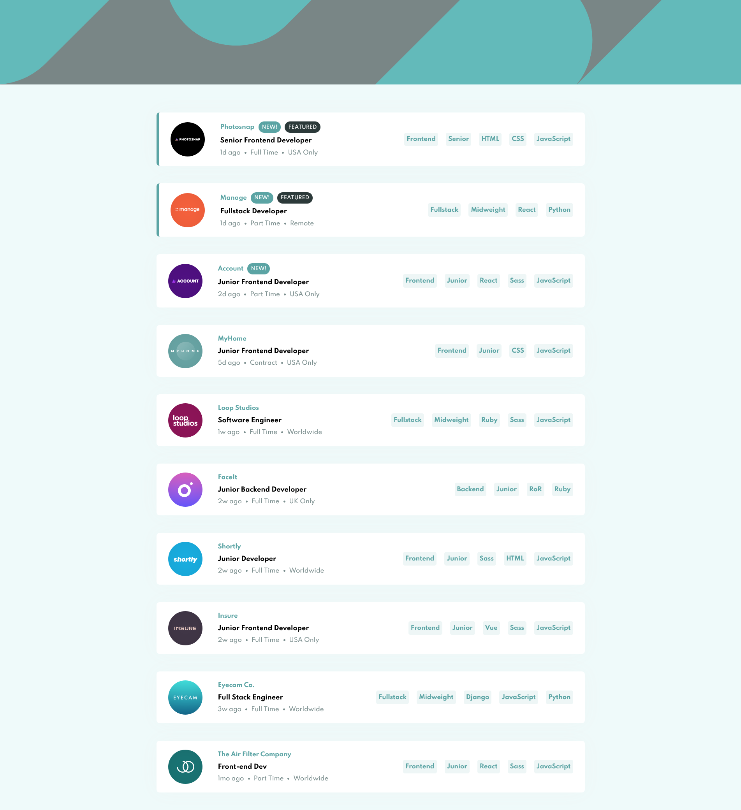

# Job listings with filtering solution 📃 || Frontend Mentor

This is a solution to the [Job listings with filtering challenge on Frontend Mentor](https://www.frontendmentor.io/challenges/job-listings-with-filtering-ivstIPCt). Frontend Mentor challenges help you improve your coding skills by building real projects.

## Table of contents

- [Overview](#overview)
  - [The challenge](#the-challenge)
  - [Screenshot](#screenshot)
  - [Links](#links)
- [My process](#my-process)
  - [Built with](#built-with)
  - [What I learned](#what-i-learned)
  - [Useful resources](#useful-resources)
- [Author](#author)

## Overview

### The challenge

Users should be able to:

- View the optimal layout for the site depending on their device's screen size
- See hover states for all interactive elements on the page
- Filter job listings based on the categories

### Screenshot



### Links

- Solution URL: [Here](https://your-solution-url.com)
- Live Site URL: [Here](https://static-job-listing-two-fawn.vercel.app/)

## My process

### Built with

- HTML
- CSS
- Flexbox
- Mobile-first workflow
- [React](https://reactjs.org/) - JS library

### What I learned

I'm proud of the code I wrote to filter the list based on the user options to look for only the jobs that match the criteria

- First I created an every() method that will check all the job listings to see if they match the criteria which are all the items in the filterItems array.

```js
const criteria = filterItems.every((item) => {})
```

- Then since the languages and tools for each job are an array I needed to create a method to figure out if only one of the tools or languages is in the filterItems array. And I did this by using the some() method and returning true if any of the tools or language have the same value from the filterItems array.

```js
const criteria = filterItems.every((item) => {
  const languages = job.languages.some((language) => {
    return language === item
  })

  const tools = job.tools.some((tools) => {
    return tools === item
  })
})
```

- Finally, the every() method will return true if the job has every item from the filterItems array. We have to look for 4 things in each job which are:

1. Job Role
1. Job Level
1. Job Languages
1. Job Tools

```js
return item === job.role || item === job.level || languages || tools
```

All the code for the fileting:

```js
const criteria = filterItems.every((item) => {
  const languages = job.languages.some((language) => {
    return language === item
  })

  const tools = job.tools.some((tools) => {
    return tools === item
  })
  return item === job.role || item === job.level || languages || tools
})

if (criteria === true) {
  return (
    <JobCard
      key={job.id}
      company={job.company}
      contract={job.contract}
      featured={job.featured}
      languages={job.languages}
      level={job.level}
      location={job.location}
      logo={job.logo}
      new={job.new}
      position={job.position}
      postedAt={job.postedAt}
      role={job.role}
      tools={job.tools}
      addToFilter={addToFilter}
    />
  )
}
```

### Useful resources

- [Stackoverflow](https://stackoverflow.com/questions/31831651/javascript-filter-array-multiple-conditions) - I used this to help me understand how to filter the array based on multiple conditions. especially when using every() to check all the filter items list and make only the job that has all the filter items only passed.

## Author

- Website - [Mohanad Alrwaihy](https://mohanad-portfolio.pages.dev/)
- Frontend Mentor - [@MohanadOO](https://www.frontendmentor.io/profile/MohanadOO)
